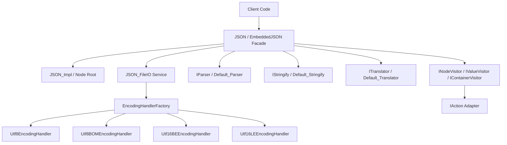

# SOLID Architecture & Design Patterns in JSON_Lib

This document provides a comprehensive architectural guide to the design patterns and SOLID principles applied in `JSON_Lib`.

---

## 1. Overview

`JSON_Lib` is a modern, high-performance C++23 library for parsing, manipulating, serializing, and storing JSON data. Following a comprehensive refactoring, `JSON_Lib` strictly adheres to all five **SOLID** principles of object-oriented software design while maintaining 100% backward compatibility for public facade callers and RTOS/embedded targets.

---

## 2. High-Level Architecture Diagram



---

## 3. SOLID Design Principles in JSON_Lib

### 3.1 Single Responsibility Principle (SRP)
*A module should have one, and only one, reason to change.*

* **`JSON_FileIO` Service**: Disk file I/O operations (`fromFile`, `toFile`, `getFileFormat`), byte order mark (BOM) detection, and CRLF line normalization are handled by the dedicated [`JSON_FileIO`](file:///home/robt/projects/JSON_Lib/classes/include/implementation/file/JSON_FileIO.hpp) service class rather than `JSON_Impl`.
* **`EncodingHandlers` Strategy**: Stream character encoding conversions are isolated within specific strategy classes in [`EncodingHandlers.hpp`](file:///home/robt/projects/JSON_Lib/classes/include/implementation/io/encoding/EncodingHandlers.hpp).

---

### 3.2 Open/Closed Principle (OCP)
*Software entities should be open for extension, but closed for modification.*

* **Extensible File Encodings**: New file encodings (such as UTF-32 or custom binary encodings) can be introduced by creating a class implementing [`IEncodingHandler`](file:///home/robt/projects/JSON_Lib/classes/include/interface/IEncodingHandler.hpp) and registering it in `EncodingHandlerFactory`. File I/O routines do not require modification.
* **Pluggable Stringify & Parser Backends**: Custom serialization backends (JSON compact, JSON pretty-print, XML, YAML, Bencode) implement [`IStringify`](file:///home/robt/projects/JSON_Lib/classes/include/interface/IStringify.hpp) or [`IParser`](file:///home/robt/projects/JSON_Lib/classes/interface/IParser.hpp).

---

### 3.3 Liskov Substitution Principle (LSP)
*Subtypes must be substitutable for their base types.*

* **`XML_Stringify` Substitutability**: [`XML_Stringify`](file:///home/robt/projects/JSON_Lib/classes/include/implementation/stringify/XML_Stringify.hpp) serializes arrays of any size (0, 1, or $N$) into clean `<Row>...</Row>` XML elements consistently.
* **Substitutable Strategy Interfaces**: All custom implementations of `IStringify`, `IParser`, `ITranslator`, and `IEncodingHandler` can be interchanged without altering program correctness.

---

### 3.4 Interface Segregation Principle (ISP)
*Clients should not be forced to depend on methods they do not use.*

* **Fine-Grained Node Visitor Interfaces**: Observers can choose to implement fine-grained interfaces defined in [`INodeVisitor.hpp`](file:///home/robt/projects/JSON_Lib/classes/include/interface/INodeVisitor.hpp):
  - `INodeVisitor`: Listens to generic `onNode(Node&)` events.
  - `IValueVisitor`: Listens to primitive values (`onString`, `onNumber`, `onBoolean`, `onNull`).
  - `IContainerVisitor`: Listens to structural containers (`onObject`, `onArray`).
* For backward compatibility, `IAction` acts as a composite adapter inheriting from all three visitor interfaces.

---

### 3.5 Dependency Inversion Principle (DIP)
*High-level modules should not depend on low-level modules. Both should depend on abstractions.*

* **Injected `ITranslator` Abstraction**: High-level `JSON` and `JSON_Impl` facade classes accept injected `std::unique_ptr<ITranslator>` instances via [`JSON::Options`](file:///home/robt/projects/JSON_Lib/classes/include/JSON.hpp) or constructor parameters.
* High-level document operations depend entirely on abstract interfaces (`IParser`, `IStringify`, `ITranslator`, `ISource`, `IDestination`, `IEncodingHandler`).

---

## 4. Code Examples

### 4.1 Dependency Injection via `JSON::Options`
```cpp
#include "JSON_Lib.hpp"

namespace js = JSON_Lib;

struct CustomEscaper final : public js::ITranslator {
  std::string from(const std::string_view &escaped) const override {
    return std::string(escaped);
  }
  std::string to(const std::string_view &raw) const override {
    return std::string(raw);
  }
};

js::JSON::Options options;
options.setTranslator(std::make_unique<CustomEscaper>())
       .setStringify(js::makeStringify<js::Default_Stringify>());

js::JSON json(std::move(options));
```

### 4.2 Fine-Grained Traversal with `IAction` / `INodeVisitor`
```cpp
#include "JSON_Lib.hpp"
#include "INodeVisitor.hpp"

namespace js = JSON_Lib;

class ElementCounter : public js::IAction {
public:
  int nodesVisited = 0;
  void onNode(const js::Node &) override { nodesVisited++; }
};

js::JSON json;
json.parse(js::BufferSource{ R"({"a": [1, 2, 3]})" });

ElementCounter counter;
json.traverse(counter);
```
